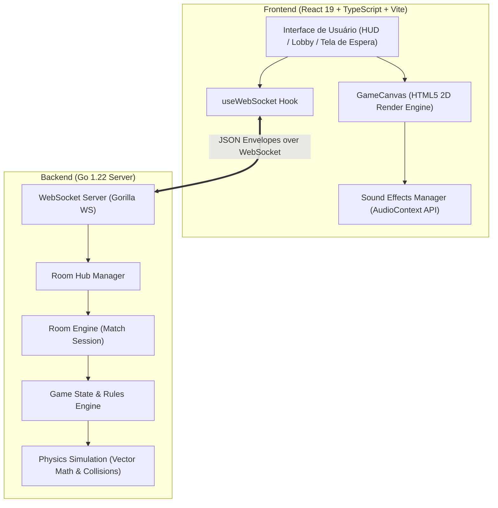
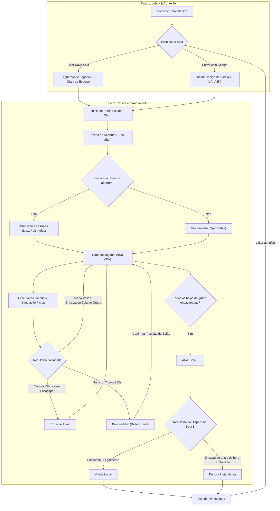
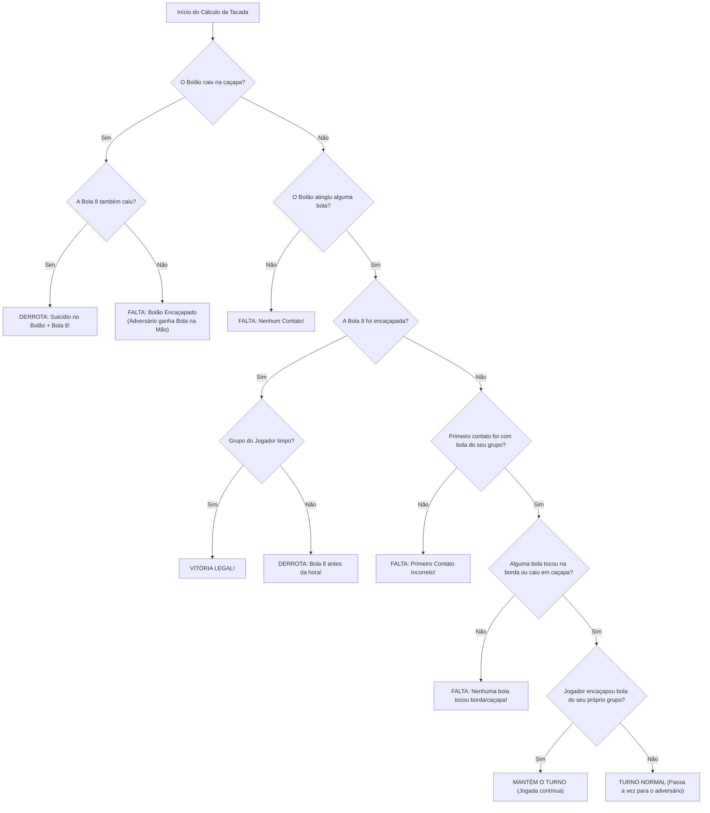
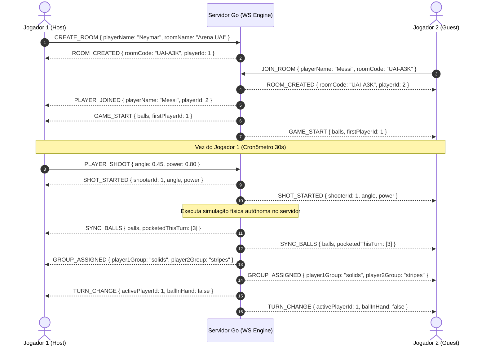

# 🎱 8-Pool-UAI — Jogo de Sinuca Multiplayer em Tempo Real

[](https://go.dev/)
[](https://react.dev/)
[](https://www.typescriptlang.org/)
[](https://vitejs.dev/)
[](https://developer.mozilla.org/en-US/docs/Web/API/WebSockets_API)

**8-Pool-UAI** é um jogo completo de sinuca estilo _8-Ball Pool_ (Bola 8) multiplayer em tempo real, desenvolvido com backend autônomo e autoritativo em **Go (Golang)** e frontend dinâmico em **React + Canvas 2D + TypeScript**.

O projeto conta com simulação física 2D autoritativa no servidor, gerenciador de salas por código único (`UAI-XXX`), verificação completa de regras oficiais de bola 8, suporte a Bola na Mão (_Ball-in-Hand_), cronômetro por turno e interface rica com física de rolagem e efeitos sonoros/visuais.

---

## 📑 Sumário

- [📐 Arquitetura do Sistema](#-arquitetura-do-sistema)
- [🎮 Fluxo do Jogo & Máquina de Estados](#-fluxo-do-jogo--máquina-de-estados)
- [📜 Regras do Jogo (8-Ball Pool)](#-regras-do-jogo-8-ball-pool)
- [🧮 Fluxo de Decisão de Tacadas & Faltas](#-fluxo-de-decisão-de-tacadas--faltas)
- [🔄 Protocolo de Comunicação WebSocket](#-protocolo-de-comunicação-websocket)
- [🧮 Motor de Física & Validação no Servidor](#-motor-de-física--validação-no-servidor)
- [⌨️ Controles e Interface (HUD)](#-controles-e-interface-hud)
- [🚀 Como Executar o Projeto](#-como-executar-o-projeto)
- [📂 Estrutura do Repositório](#-estrutura-do-repositório)

---

## 📐 Arquitetura do Sistema

A arquitetura adota o modelo **Servidor Autoritativo**: todo cálculo físico e validação de regras ocorrem no servidor Go. O cliente React é responsável por capturar o input do jogador (ângulo e força da tacada), renderizar a mesa via HTML5 Canvas 2D e animar as trajetórias das bolas enviadas pelo servidor.



---

## 🎮 Fluxo do Jogo & Máquina de Estados

O ciclo de vida de uma partida passa por fases bem definidas, desde a criação da sala até a definição do vencedor.




---

## 📜 Regras do Jogo (8-Ball Pool)

As regras seguem o padrão oficial de Bola 8 adaptado para ambiente digital:

### 1. Bola e Identificação de Grupos

- **Bolão (ID 0)**: Bola branca de tacada.
- **Grupo Lisas (Solids - IDs 1 a 7)**: Bolas de cor sólida.
- **Bola 8 (ID 8)**: Bola preta alvo final do jogo.
- **Grupo Listradas (Stripes - IDs 9 a 15)**: Bolas com faixa listrada.

### 2. Abertura da Mesa (Break Shot)

- Na tacada inicial, a mesa é considerada **Aberta (GroupNone)**.
- Se qualquer bola (lisa ou listrada) for encaçapada na abertura, o jogador atual recebe o grupo da bola encaçapada e o adversário recebe o grupo oposto.
- Na abertura, atingir qualquer bola primeiro não constitui falta.

### 3. Turno Normal e Atribuição de Grupos

- Enquanto a mesa estiver aberta, o grupo é definido pela primeira bola não-especial encaçapada.
- Após a definição dos grupos:
  - O jogador de **Lisas** DEVE atingir uma bola lisa (1-7) como o primeiro contato do bolão.
  - O jogador de **Listradas** DEVE atingir uma bola listrada (9-15) como o primeiro contato do bolão.
  - Se um jogador acertar todas as suas bolas do grupo, seu alvo principal passa a ser obrigatoriamente a **Bola 8**.

### 4. Faltas (Fouls) e Bola na Mão (_Ball-in-Hand_)

Uma falta ocorre quando:

1. ⚪ **Bolão Encaçapado**: O bolão cai em uma das caçapas.
2. 🚫 **Primeiro Contato Incorreto**: O bolão atinge primeiro uma bola do adversário ou a bola 8 (antes de limpar seu próprio grupo).
3. 👻 **Nenhum Contato**: O bolão não atinge nenhuma bola.
4. 🛑 **Sem Borda ou Caçapa**: Após o impacto do bolão com a bola alvo, nenhuma bola toca a borda/tabela nem cai em caçapa.
5. ⏳ **Tempo Esgotado (Timeout)**: O jogador ativo não realiza a tacada em até **30 segundos**.

**Penalidade para Falta**: O adversário recebe **Bola na Mão (Ball-in-Hand)** em toda a extensão da mesa, podendo reposicionar livremente o bolão em qualquer ponto válido da mesa sem sobrepor outras bolas.

### 5. Condições de Vitória e Derrota

- 🏆 **Vitória Válida**: Um jogador encaçapa todas as 7 bolas do seu grupo e, em seguida, encaçapa legalmente a **Bola 8**.
- 💀 **Derrota Instantânea**:
  - Encaçapar a **Bola 8** antes de ter encaçapado todas as bolas do seu grupo.
  - Encaçapar o **Bolão** e a **Bola 8** na mesma tacada (_suicídio_).

---

## 🧮 Fluxo de Decisão de Tacadas & Faltas



---

## 🔄 Protocolo de Comunicação WebSocket

As mensagens são encapsuladas no formato JSON utilizando Envelopes com a chave `type` e `payload`.

### 📩 Mensagens Enviadas pelo Cliente (Client -> Server)

| Tipo (`type`)    | Payload Exemplo                                       | Descrição                                                            |
| :--------------- | :---------------------------------------------------- | :------------------------------------------------------------------- |
| `CREATE_ROOM`    | `{"playerName": "Neymar", "roomName": "Sala do Ney"}` | Cria uma nova sala e define o Host como Player 1.                    |
| `JOIN_ROOM`      | `{"playerName": "Messi", "roomCode": "UAI-A3K"}`      | Entra em uma sala existente como Player 2.                           |
| `PLAYER_SHOOT`   | `{"angle": 1.57, "power": 0.85}`                      | Realiza a tacada informando o ângulo (radianos) e força (0.0 a 1.0). |
| `PLACE_CUE_BALL` | `{"position": {"x": 260.0, "y": 260.0}}`              | Posiciona o bolão durante a fase de _Ball-in-Hand_.                  |

### 📤 Mensagens Enviadas pelo Servidor (Server -> Client)

| Tipo (`type`)    | Payload Conteúdo Principais                            | Descrição                                                  |
| :--------------- | :----------------------------------------------------- | :--------------------------------------------------------- |
| `ROOM_CREATED`   | `roomCode`, `roomName`, `playerId`                     | Confirmação de criação da sala.                            |
| `PLAYER_JOINED`  | `playerName`, `playerId`                               | Notifica o host que o Player 2 ingressou.                  |
| `GAME_START`     | `balls`, `firstPlayerId`, `player1Name`, `player2Name` | Notifica início da partida e envia posições iniciais.      |
| `SHOT_STARTED`   | `shooterId`, `angle`, `power`                          | Sinaliza início de disparo para sincronização visual.      |
| `SYNC_BALLS`     | `balls`, `pocketedThisTurn`                            | Sincroniza o estado final de todas as bolas.               |
| `TURN_CHANGE`    | `activePlayerId`, `ballInHand`                         | Notifica a alteração do jogador ativo e se há bola na mão. |
| `FOUL`           | `reason`, `playerId`                                   | Emite alerta de falta com descrição em português.          |
| `GROUP_ASSIGNED` | `player1Group`, `player2Group`                         | Comunica os grupos atribuídos (solids/stripes).            |
| `GAME_OVER`      | `winnerId`, `winnerName`, `reason`                     | Anuncia o fim de jogo, campeão e motivo.                   |



---

## 🧮 Motor de Física & Validação no Servidor

- **Dimensões Internas da Mesa**: `1040 x 520` unidades de jogo.
- **Raio da Bola**: `12.0` unidades (Diâmetro = `24.0`).
- **Raio da Caçapa**: `22.0` unidades (6 caçapas nos cantos e centros).
- **Atrito da Mesa**: Multiplicador de velocidade por frame (`0.985`).
- **Restituição (Quique nas Bordas)**: `0.75` (perda de 25% da velocidade em rebotes).
- **Restituição (Colisão Bola-Bola)**: `0.96` (conservação elástica do momento com compensação de sobreposição).
- **Limite de Velocidade Máxima da Tacada**: `25.0` unidades/frame.

---

## ⌨️ Controles e Interface (HUD)

- **Mira com o Taco**: Movimente o mouse ao redor do bolão na mesa para ajustar o ângulo de mira. A trajetória prevista é desenhada com linha pontilhada e retículo de impacto.
- **Medidor de Força**: Clique e arraste na barra vertical à direita para selecionar a intensidade do impacto (0% a 100%).
- **Confirmação de Tacada**: Clique no botão **TUTAR!** para disparar.
- **Bola na Mão (Ball-in-Hand)**: Quando o aviso de bola na mão for exibido, clique e arraste o bolão diretamente na mesa até a posição desejada e clique em **Confirmar**.
- **Painel HUD**: Exibe o avatar dos dois jogadores, indicativo de quem é o jogador local, grupo de bolas atribuído, indicador de turno ativo, contagem de bolas restantes e cronômetro regressivo.

---

## 🚀 Como Executar o Projeto

### Pré-requisitos

- [Go (Golang)](https://golang.org/) **1.22+**
- [Node.js](https://nodejs.org/) **18+** e `npm`

### 1. Iniciar o Servidor Backend (Go)

```bash
# Acesse o diretório do servidor
cd server

# Baixe as dependências (Gorilla WebSocket)
go mod download

# Execute o servidor
go run cmd/server/main.go
```

O servidor iniciará na porta `:8080` exibindo o log:
`[Server] 8-Pool-UAI Backend running on :8080`

### 2. Iniciar a Aplicação Frontend (React + Vite)

Em um novo terminal:

```bash
# Acesse o diretório do aplicativo frontend
cd app

# Instale as dependências
npm install

# Inicie o servidor de desenvolvimento
npm run dev
```

O frontend estará acessível em `http://localhost:5173`.

### 3. Testando Partida Multiplayer Localmente

1. Abra duas janelas/abas do navegador em `http://localhost:5173`.
2. Na **Aba 1**: Digite seu nome e clique em **Criar Sala**. Copie o código gerado (ex: `UAI-A3K`).
3. Na **Aba 2**: Digite o nome do segundo jogador, cole o código da sala e clique em **Entrar na Sala**.
4. O jogo iniciará automaticamente para ambos!

---

## 📂 Estrutura do Repositório

```
8-pool-uai/
├── README.md                  # Documentação completa do projeto
├── server/                    # Backend em Go
│   ├── cmd/
│   │   └── server/
│   │       └── main.go        # Ponto de entrada do servidor HTTP/WebSocket
│   ├── internal/
│   │   ├── game/              # Motor de jogo (game.go, physics.go, rules.go)
│   │   ├── protocol/          # Definições de mensagens e envelopes WebSocket (protocol.go)
│   │   └── room/              # Gerenciador de salas e clientes (hub.go, room.go, client.go)
│   ├── go.mod
│   └── go.sum
└── app/                       # Frontend React + TypeScript
    ├── src/
    │   ├── components/        # Componentes UI (GameCanvas, HUD, Lobby, WaitingRoom)
    │   ├── engine/            # Renderizador 2D da mesa e partículas
    │   ├── hooks/             # Custom hook de WebSocket (useWebSocket.ts)
    │   ├── types.ts           # Definições de tipos TypeScript
    │   ├── App.tsx            # Componente raiz
    │   └── main.tsx           # Ponto de entrada do React
    ├── index.html
    ├── package.json
    └── vite.config.ts
```

---

<p align="center">
  Desenvolvido com 🎱 e ☕ — 8-Pool-UAI
</p>
